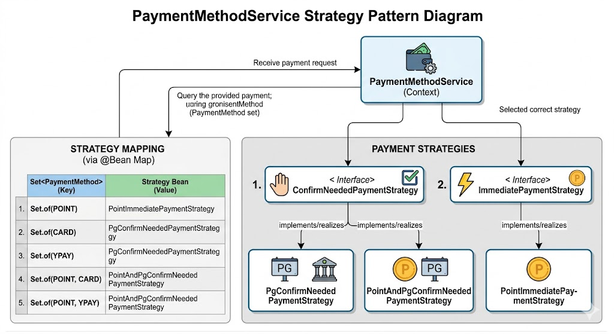

# 설계 및 구현 고려사항

---

# 과제 기본 가정

## 회원 인증/인가 제외

본 과제에서는 회원 인증 및 로그인 기능은 구현 범위에서 제외하였습니다.

따라서 API 요청 시 인증을 대신하여 아래와 같이 `memberId` 를 직접 전달받는 형태로 가정하였습니다.

```http
X-MEMBER-ID: 1
```

---

## 분산 서버 환경 가정

애플리케이션 서버는 최소 2대 이상의 분산 환경으로 구성된 상황을 가정하였습니다.

따라서 다음 요소들을 중요하게 고려하였습니다.

- 중복 요청 처리
- 재고 정합성
- 멱등성 보장
- 다중 서버 환경에서의 동시성 문제
- Redis 장애 상황 대응
- 순간적인 트래픽 폭증 대응

---

# 재고 정합성 및 공정한 기회

이벤트성 선착순 결제 시스템에서는 다음 두 가지가 가장 중요하다고 판단하였습니다.

1. 초과 판매가 절대 발생하지 않을 것
2. 사용자들에게 최대한 공정한 기회를 제공할 것

이를 위해 다음 두 가지 전략을 적용하였습니다.

- Redis 기반 대기 큐
- 재고 Reserve(예약) 전략

---

# 1. Redis 기반 대기 큐

이벤트 결제 API 앞단에 Redis 기반 대기 큐를 두는 구조를 고려하였습니다.

---

## 목적

이벤트 시작 시 모든 사용자가 동시에 결제 시스템으로 진입하면:

- DB 커넥션 고갈
- 긴 트랜잭션
- PG 요청 폭증
- 서버 장애

문제가 발생할 수 있습니다.

따라서 일부 사용자만 순차적으로 결제 단계에 진입하도록 제어하는 구조를 선택하였습니다.

---

## 대기 큐 진입

사용자의 요청은 Redis Sorted Set 기반 대기열에 저장됩니다.

```text
waiting_queue
```

Sorted Set 의 score 에는 요청 시간(timestamp)을 저장하여,
먼저 요청한 사용자가 우선적으로 처리되도록 구성하였습니다.

---

## 순차 입장 처리

스케줄러(또는 워커)가 일정 주기마다
대기열의 앞부분 사용자 일부를 조회합니다.

이후 해당 사용자들을:

```text
enterable_users
```

Set 에 추가하여 일정 시간 동안 실제 결제 API에 접근 가능하도록 처리합니다.

---

## 클라이언트 처리 방식

클라이언트는 polling 방식으로 자신의 상태를 조회합니다.

```text
대기 중
→ 입장 가능
→ 결제 페이지 진입
```

`enterable_users` 에 포함된 사용자만
실제 주문/결제 API 호출이 가능합니다.

---

## 기대 효과

- 순간 트래픽 완화
- DB 보호
- 공정한 순서 보장
- 결제 시스템 안정성 확보
- PG 서버 과부하 방지

---

# 2. 재고 Reserve 전략

결제 생성 시점에는 실제 재고를 즉시 차감하지 않고,
먼저 Reserve(예약) 처리만 수행합니다.

---

## Reserve 방식

### 주문 생성 시

```text
reserved_stock 증가
```

### 결제 승인 완료 시

```text
reserved_stock 감소
total_stock 감소
```

---

## Why?

PG 결제는 여러 단계로 이루어집니다.

```text
주문 생성
→ 결제창 진입
→ 카드 인증
→ PG 승인
→ 최종 완료
```

만약 주문 생성 시점에 바로 재고를 차감하면:

- 결제 실패
- 사용자 이탈
- PG 오류
- 결제 중 브라우저 종료

상황에서 재고 복구가 매우 복잡해질 수 있습니다.

따라서:

```text
Reserve → 결제 성공 시 최종 차감
```

구조를 선택하였습니다.

---

# 3. 재고 정합성 보장

재고를 생긴하는 경우에는
비관적 락(Pessimistic Lock)을 이용하여 재고를 갱신합니다.

---

## 목적

동시 결제 상황에서:

```text
초과 판매(Overselling)
```

를 방지하기 위함입니다.

---

## 결과

재고가 부족한 경우:

```text
reserve 실패
```

처리되므로 재고 정합성이 유지됩니다.

---

# 고가용성 및 성능 고려

이벤트 상황에서는 평소 TPS 대비
10~20배 이상의 트래픽이 발생할 수 있다고 가정하였습니다.

따라서 가장 비용이 큰 DB I/O 를 줄이는 방향으로 설계하였습니다.

---

# 1. 체크아웃 API 최적화

체크아웃 API는 조회 빈도가 매우 높은 API 입니다.

특히 상품 정보는:

- 조회 빈도 높음
- 변경 빈도 낮음

특징을 가진다고 판단하였습니다.

---

## 상품 정보 캐싱

상품 정보는 DB 대신
애플리케이션 내부 메모리 캐시(Caffeine 라이브러리)에서 조회하도록 설계하였습니다.
시스템이 실행될때, 이벤트상품 정보를 캐시에 로딩합니다.

---

## Why Local Cache?

Redis 역시 장애가 발생할 수 있는 외부 시스템이라고 판단하였습니다.

이벤트 상황에서는:

```text
최대한 빠른 응답
+
외부 의존 최소화
```

가 중요하다고 생각하여
In-Memory Cache 방식을 선택하였습니다.

또한 이벤트 상품 정보는 일반적으로 짧은 시간 동안 변경 가능성이 매우 낮다고 판단하였습니다.

---

## 기대 효과

- DB 조회 제거
- Redis 의존 제거
- 매우 빠른 응답 속도
- 대량 트래픽 대응

---

## 포인트 조회는 DB 사용

반면 사용자 포인트는:

- 실시간성 중요
- 정합성 중요

특징이 있으므로 캐시 대신 DB에서 직접 조회하였습니다.

---

# 2. 결제 Confirm API 최적화

결제 승인 단계는 다음과 같은 느린 작업들이 포함됩니다.

- DB Insert / Update
- PG 네트워크 통신
- 재고 확정 처리

따라서 순간적인 트래픽 증가 시:

- DB 커넥션 고갈
- 긴 트랜잭션
- 응답 지연

문제가 발생할 수 있습니다.

---

## 핵심 전략

대기 큐를 통해
일부 사용자만 최종 결제 단계로 진입하도록 제한합니다.

즉:

```text
대기 큐가 DB와 결제 시스템을 보호
```

하는 구조입니다.

---

# 멱등성(Idempotency)

멱등성이란:

```text
동일 요청을 여러 번 보내도
최종 결과가 동일하게 유지되는 성질
```

을 의미합니다.

---

# 주문 생성 API 멱등성

클라이언트는 요청 시
고유한 멱등 키(UUID 등)를 함께 전달합니다.

```json
{
  "idempotencyKey": "ORDER-20260507-0001"
}
```

---

## 처리 방식

### 최초 요청

- 주문 생성 수행
- DB 저장
- 응답 반환

---

### 중복 요청

동일 키가 이미 존재하는 경우:

```text
기존 주문 결과 반환
```

처리합니다.

---

## Why?

다음 상황들을 고려하였습니다.

- 모바일 네트워크 재시도
- 브라우저 새로고침
- 사용자 더블 클릭
- Timeout 이후 재요청

---

# 결제 Confirm API 멱등성

결제 Confirm API 는
특히 중복 승인 방지가 중요합니다.

---

## 처리 방식

결제 데이터를 비관적 락으로 조회한 뒤:

```text
READY → PROCESSING
```

상태로 변경합니다.

---

## 결과

이미:

```text
PROCESSING
PAID
FAILED
```

상태인 요청은
추가 처리되지 않도록 검증합니다.

이를 통해 중복 승인 요청 및 중복 재고 차감을 방지합니다.

---

# 결제 확장성

현재 지원 결제 방식:

- 포인트
- 카드
- Y페이
- 포인트 + 카드
- 포인트 + Y페이

이후 새로운 결제 방식이 추가될 가능성을 고려하였습니다.

---

# 결제 전략 패턴 구조

현재 시스템은 결제 방식이 계속 추가될 수 있는 상황을 고려하여  
Strategy Pattern 기반으로 결제 로직을 분리하였습니다.

---

# 설계 목표

다음 문제를 해결하는 것을 목표로 하였습니다.

- 결제 수단 증가 시 if/else 폭증 방지
- 결제 방식 조합별 로직 분리
- 기존 코드 수정 최소화
- 새로운 결제 수단 확장 용이성 확보

---

# 핵심 아이디어

결제를 크게 두 그룹으로 나누었습니다.

| 구분 | 설명 |
|---|---|
| Immediate Payment | 즉시 결제 완료 가능한 결제 |
| Confirm Needed Payment | PG 승인(confirm)이 필요한 결제 |

---

# Immediate Payment

즉시 결제가 가능한 방식입니다.

예:

- 포인트 결제

특징:

```text
별도 PG 승인 없이
즉시 결제 완료 가능
```

---

# Confirm Needed Payment

외부 PG 승인 절차가 필요한 방식입니다.

예:

- 카드 결제
- YPAY 결제
- 포인트 + 카드
- 포인트 + YPAY

특징:

```text
주문 생성
→ PG 결제창
→ PG Confirm API 호출
→ 최종 결제 완료
```

구조를 가집니다.

---

# 전략 선택 방식

결제 수단 조합(Set<PaymentMethod>)을 Key 로 사용하여  
적절한 전략 객체를 선택합니다.

---


## 장점

새로운 결제 수단이 추가되더라도:

- 기존 코드 수정 최소화
- 전략 클래스 추가만으로 확장 가능
- OCP(Open Closed Principle) 유지

가능하도록 설계하였습니다.
PaymentMethodServiceConfig.java 참고

---

# 장애 대응 및 예외 처리

---

# 1. Redis 장애 대응

Redis 장애 시에는
대기 큐 기능이 동작하지 않을 수 있습니다.

이 경우:

```text
In-Memory Rate Limiter
```

가 동작하도록 설계하였습니다.

---

## 특징

공정성은 다소 낮아질 수 있지만:

```text
시스템 전체 장애 방지
```

를 우선 목표로 하였습니다.

즉:

```text
완벽한 공정성보다
서비스 생존성을 우선
```

하도록 판단하였습니다.

---

# 2. 결제 실패 처리

---

## 일반 실패

예:

- 잔액 부족
- 카드 한도 초과
- 사용자 인증 실패

처리:

```text
FAILED 상태 변경 후 사용자 반환
```

---

## PG Timeout

가장 위험한 상황 중 하나입니다.

```text
요청 결과를 알 수 없음
```

상태가 되기 때문입니다.

---

## 처리 전략

1. 내부 Retry 수행
2. 그래도 실패 시 UNKNOWN 상태 저장
3. 복구 스케줄러가 후속 처리

---

## 서버 다운 상황

예시:

```text
PG 승인 성공
BUT
서버 다운
```

이 경우 DB 반영이 실패할 수 있습니다.

---

## 대응 방식

PROCESSING 상태가
일정 시간 이상 유지되는 경우:

```text
복구 스케줄러가 PG 상태 재조회
```

후 결과를 반영합니다.

이를 통해:

```text
PG 상태와 내부 DB 상태 불일치
```

문제를 최소화하려고 하였습니다.

---

# 추가 인프라

---

## 1. 복구 스케줄러

처리 대상:

- PROCESSING 상태
- UNKNOWN 상태

역할:

- PG 상태 재조회
- 미완료 결제 복구
- 상태 동기화

---

## 2. Redis 기반 대기 큐

역할:

- 트래픽 제어
- 공정한 순서 보장
- DB 보호
- 결제 시스템 보호

---

# AI 활용

개발 과정에서 AI 를 다음 용도로 활용하였습니다.

---

## 1. 문서화 보조

직접 작성한 내용을 기반으로:

- README 초안 작성
- 문장 정리
- API 설명 정리

등에 활용하였습니다.

---

## 2. 반복 코드 생성

예:

- DTO
- DDL
- Boilerplate 코드

생성에 활용하여 생산성을 높였습니다.

---

## 3. 리팩토링 아이디어 참고

구조 개선이나 설계 방향 검토 시
참고 용도로 활용하였습니다.

---

## 4. 새로운 기술 학습

새로운 라이브러리나 프레임워크를 학습할 때:

- 예제 코드 생성
- 빠른 사용법 파악

등에 활용하였습니다.